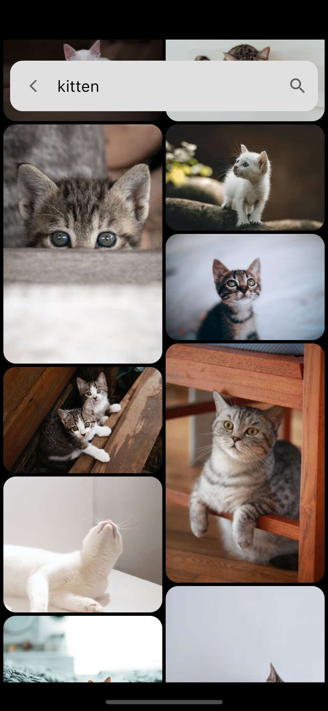
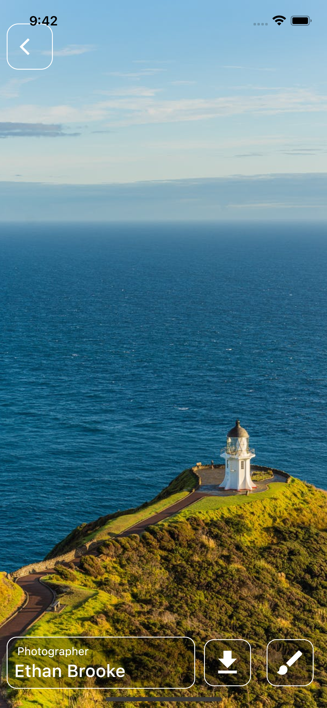

# Wallpaper App Flutter

A Flutter application to view endless stream of wallpapers and user can also download or set wallpapers using this app.

 &nbsp;  &nbsp;  &nbsp;  &nbsp; 

### Prerequisites

**Flutter**

- [Flutter documentation](https://flutter.dev/docs)
- [Lab: Write your first Flutter app](https://flutter.dev/docs/get-started/codelab)
- [Cookbook: Useful Flutter samples](https://flutter.dev/docs/cookbook)

## About App

Wall-E is an app that has a huge collection of cool-looking
wallpapers for your home screen backgrounds.
This app utilizes [Pexels API](https://www.pexels.com/api/documentation/) and provides a lot of cool wallpapers with categories and
searches terms. The user can also set wallpaper on their home
screen and save them as media in their local storage.

## Supported Features

- :white_check_mark: New Wallpapers every hour
- :white_check_mark: Searching for Wallpapers
- :white_check_mark: Endless Stream of Wallpapers(like pinterest)
- :white_check_mark: Setting Wallpaper on HomeScreen
- :white_check_mark: Saving high quality images to local storage
  

## Packages in use

- cached_network_image: ^3.2.1
- flutter_staggered_grid_view: ^0.6.1
- http: ^0.13.4
- lazy_load_scrollview: ^1.3.0
- wallpaper_manager_flutter: ^0.0.2
- flutter_cache_manager: ^3.3.0
- gallery_saver: ^2.3.2
- dio: ^4.0.6
- path_provider: ^2.0.11

## About the Pexels API

This endpoint enables you to receive real-time photos curated by the Pexels team. They add at least one new photo per hour to their curated list so that user always get a changing selection of trending photos.

https://api.pexels.com/v1/curated?per_page=1

**Note**: to use the API you'll need to register an account and obtain your own API key.

